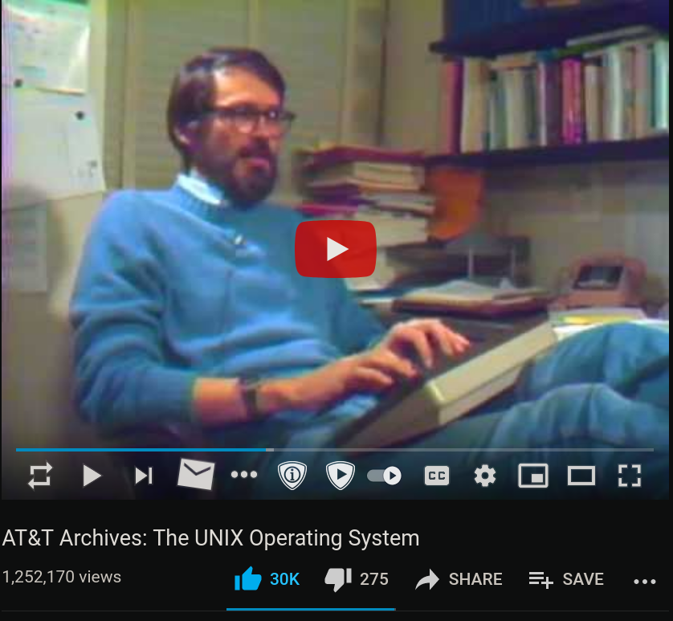
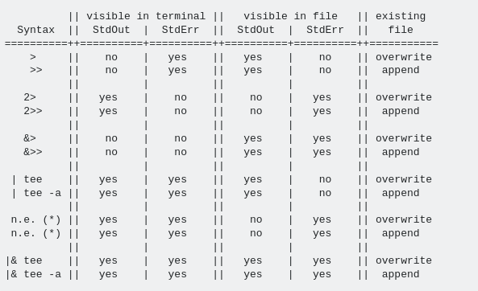

# Shell Scripting
 - Brief Overview
 - Going to introduce new tools
 - Aimed for beginners/intermediate users
 - `Man` is your best friend
 - https://youtu.be/tc4ROCJYbm0



---

# What is Shell Scripting?
  - A program that runs on a shell
  - File manipulation
  - Text Printing
  - System monitoring and backup
  - Task Automation
  


---

# Langauges for shell scripting
  - Perl 5
  - Python
  - Dart
  - sh and its derivatives (our focus)

| Shell      | Expanded                   | Family                    |
|------------|----------------------------|---------------------------|
| sh         | Bourne Shell               | ~                         |
| csh        | C Shell                    | ~                         |
| tcsh       | *TENEX Copmeletion Shell   | csh                       |
| bash       | Bourne Again Shell         | sh                        |
| zsh        | Z Shell                    | sh                        |
| fish       | Friendly Interactive Shell | ~                         |
| dash       | Debian Almquist shell      | sh                        |
| xonsh      | Python-powered shell       | ~                         |
| powershell | .Net(?) Shell              | Windows                   |
| nushell    | "A new type of shell"      | ~                         |
| rush       | Ru-sh                      | Made by me and friends :) |

* Not totally accurate
* Btw it's not hard to write your own shell

---

# Some Vocab to Know

| Word                          | Definition                                                                   |
|-------------------------------|------------------------------------------------------------------------------|
| Shell                         | An environment/interface that connect a user with the OS                     |
| Terminal Emulator             | An emulator that mimics an environment with monitor and keyboard setup (tty) |
| TTY                           | Teletypewriter *                                                             |
| Command Line (CLI)            | A line on which commands are typed to be runned                              |
| Command Prompt                | The prompt at the start of the command line / `echo $PS1`                    |
| Terminal User Interface (TUI) | A program that runs in the terminal                                          |

http://www.linusakesson.net/programming/tty/index.php

---

# Piping and Redirection Revisited
  - Piping: Take the output of one program and make it the input of another's

```terminal8
bash -il
```

# Redirection
  - Redirection: Change the input/output/error to somewhere else
  - https://www.gnu.org/software/bash/manual/html_node/Redirections.html

| File                    | File Descriptor | location    |
|-------------------------|-----------------|-------------|
| Standard Input \ STDIN  | 0               | /dev/stdin  |
| Standard Out \  STDOUT  | 1               | /dev/stdout |
| Standard Error \ STDERR | 2               | /dev/stderr |

---

# Advance Piping and Redirection
  - What if I wanted to find all files ending with x extension, select one, and then start in in my text editor?
  - What if I was only interested in errors?

| Symbol             | Meaning                                                           |
|--------------------|-------------------------------------------------------------------|
| -                  | Stdin                                                             |
| > file             | Redirect stout to a file (overwites)                              |
| >> file            | Append stout to a file                                            |
| < file             | Take input from a file                                            |
| 2> file            | Redirect stderr to a file                                         |
| 2> /dev/null       | Anything here will be discarded (only write to this special file) |
| 1> output 2> error | Redirect stdout to output and stdout to error                     |
| 2>&1               | Redirect stderr to stdout                                         |
| \|&                | Redirect both stderr and stdout                                   |

- Also look at `tee`!

---

# Functions, Variables, and Aliases
  - Alias: Nicknames that will be expanded by bash (shortcut)
  - Functions: Contain logic that can take arguments

```terminal8
bash -il
```
---

## For loops
```bash
for i in (0..100);
do
echo $i;
done
```

## While loops
```bash
x=1
while [ $x -le 5 ]
do
  echo "Welcome $x times"
  x=$(( $x + 1 ))
done
```
 
- https://www.gnu.org/software/bash/manual/html_node/Shell-Arithmetic.html
- https://www.gnu.org/software/bash/manual/html_node/Bash-Conditional-Expressions.html

---

# Live-demo time
- simple wallpaper script

---

# Further stuff that you should look at:
  - `cronjobs`
    - Schedule jobs
    - Automate task
    - Very helpful
  - `nohup`
    - "run a command immune to hangups, with output to a non-tty"
  - `tee`
    - A command that will help you be more confident in your piping

